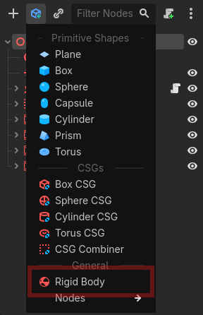
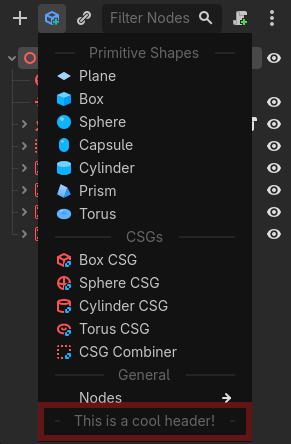
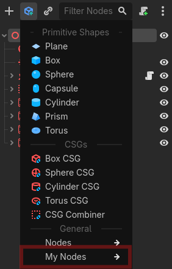
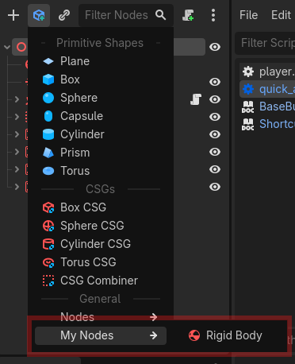
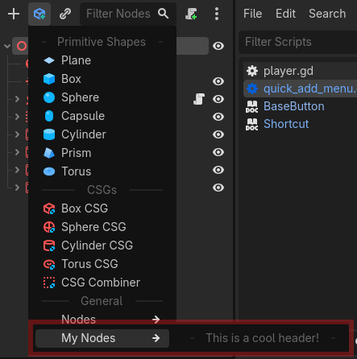
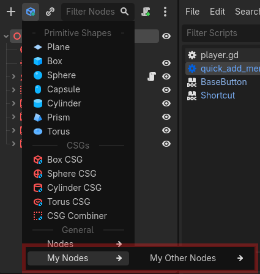

# Quick Add Menu

<br>

<div align="center">
    
</div>

<br>

A Godot addon that adds a drop down menu in the scene dock which gives quickly accessible nodes that can be added to your scene, similar to Unreal's Quick Add menu, or Unity's right click options in the scene hierarchy.

It can be expanded to include your own custom nodes as well.

The menu's items depend on the type of node you have selected.

## Bugs / Feature requests

If you notice any bugs, or have any feature requests please make a [github issue](https://github.com/Non-Existence-Software/quick-add-menu/issues) describing it so I can implement the feature or a fix.

# Customization

You can customize the Quick Add Menu by adding your own nodes, section headers, and groups.  
Customization can be done with different function calls inside and out of the `quick_add_menu.gd` `add_custom_items()` function.

This guide is inside of the `add_custom_items()` function.

## Custom Items

Items within the quick menu consist of a `String` `name`, an (optional) `Texture2D` `icon`, and a `Callable` for creating the nodes  

The callable needs to return an `Array[Node]` to work.

The first element of the returned array will be the node added to the selected node.

```gdscript
func add_custom_items(): ## Add custom items
    var create_rigidbody:Callable = func(): return [RigidBody3D.new()] as Array[Node]
    var item = QuickAddItem.new("Rigid Body", get_icon("RigidBody3D"), create_rigidbody)

    node_list["Node3D"].list.insert(15, item) # inserting at the 15th item to be before the nodes group.
```

Or one with children:  

```gdscript
func create_rigidbody() -> Array[Node]:
    var body:RigidBody3D = RigidBody3D.new()
    var collider:CollisionShape3D = CollisionShape3D.new() # Child of body
    
    collider.shape = BoxShape3D.new()

    return [body, collider]

func add_custom_items(): ## Add custom items
    var item = QuickAddItem.new("Rigid Body", get_icon("RigidBody3D"), create_rigidbody)

    node_list["Node3D"].list.insert(15, item) # inserting at the 15th item to be before the nodes group, you don't need to do this, you can just do either append or insert.
```

Both pieces of code should end up with this result:



## Custom Headers

Headers within the quick menu consist of a `String` `name`, and an optional `Texture2D` `icon`  

```gdscript
func add_custom_items(): ## Add custom items
    var header = QuickAddItem.new_header("This is a cool header!")

    node_list["Node3D"].list.append(header)
```

This code should end up with this result:



## Custom Groups

Groups within the quick menu consist of a `String` `name`, and an `int` ID to identify if an item should be under that group.  

> [!NOTE]
> The root group of the whole menu has the ID `0`, so you cannot use it. And if you want to add an item to the `Nodes` group, use the ID `1`

Here is an example of creating a group in code:

```gdscript
func add_custom_items(): ## Add custom items
    var my_id:int = 12345
    var group = QuickAddItem.new_group("My Nodes", my_id)
    
    node_list["Node3D"].list.append(group)
```

Here is what it looks like:



## Adding items to groups

Adding items to a group is as simple as adding the ID into the argument for a new item.

```gdscript
func add_custom_items(): ## Add custom items
    var my_id:int = 12345
    var group = QuickAddItem.new_group("My Nodes", my_id)

    node_list["Node3D"].list.append(group)

    var create_rigidbody:Callable = func(): return [RigidBody3D.new()] as Array[Node]
    var item = QuickAddItem.new("Rigid Body", get_icon("RigidBody3D"), create_rigidbody, my_id) # my_id is parent_item_id argument.

    node_list["Node3D"].list.append(item)
```

Here is what it should look like:



Adding Headers goes the same way:

```gdscript
func add_custom_items(): ## Add custom items
    var my_id:int = 12345
    var group = QuickAddItem.new_group("My Nodes", my_id)

    node_list["Node3D"].list.append(group)

    var header = QuickAddItem.new_header("This is a cool header!", null, my_id) # The second argument is null because it is a reference to a texture, which we do not have.

    node_list["Node3D"].list.append(header)
```

Here is what it should look like:



Then finally, sub-groups. Similar to the 2 examples above, adding in a sub-group is as simple as an extra argument

```gdscript
func add_custom_items(): ## Add custom items
    var my_id:int = 12345
    var group = QuickAddItem.new_group("My Nodes", my_id)

    node_list["Node3D"].list.append(group)

    var my_second_id:int = 123456
    var group_2 = QuickAddItem.new_group("My Other Nodes", my_second_id, my_id)

    node_list["Node3D"].list.append(group_2)
```

And this is what that should look like:



Adding Items / Headers / Sub-groups to sub-groups is the exact same as adding to normal groups except you just pass in the subgroup ID instead of the root group.
